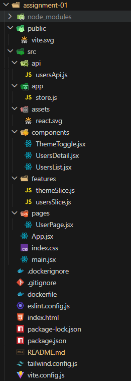

📱 User Directory Dashboard

🏗️ Folder Structure

🚀 Getting Started
Prerequisites
Node.js v18 or higher

npm v7 or higher (or yarn/pnpm)

Installation
Clone the repository

bash
git clone https://github.com/anuja12mishra/acehours.git
cd .\acehours\assignment-01\

Install dependencies

bash
npm install
Start development server

bash
npm run dev
Open in browser

text
http://localhost:5173
The app should now be running! 🎉

📦 Available Scripts
bash
# Start development server
npm run dev

# Build for production
npm run build
